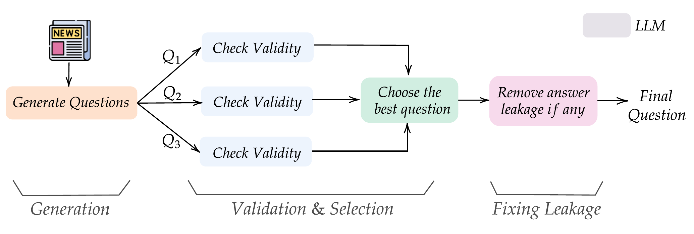

<!-- Hero Section with Resource Links -->
<section class="blog-hero">
  

    <h1 class="title">Scaling Open-Ended Reasoning To Predict the Future</h1>
    

      Nikhil Chandak* · Shashwat Goel* · Ameya Prabhu† ·
      Moritz Hardt† · Jonas Geiping†
    

    

      Max Planck Institute for Intelligent Systems · ELLIS Institute Tübingen · Tübingen AI Center ·
      University of Tübingen
    

    
*Equal contribution · †Equal co-supervision

    

      <a class="chip" data-link="arxiv" href="https://www.alphaxiv.org/abs/2512.25070" target="_blank" rel="noreferrer">
        
        Paper
      </a>
      <a class="chip" data-link="code" href="https://github.com/OpenForecaster/scaling-forecasting-training/tree/main" target="_blank" rel="noreferrer">
        
        Code
      </a>
      <a class="chip" data-link="dataset" href="https://huggingface.co/datasets/nikhilchandak/OpenForesight" target="_blank" rel="noreferrer">
        
        Dataset
      </a>
      <a class="chip" data-link="model" href="https://huggingface.co/nikhilchandak/OpenForecaster-8B" target="_blank" rel="noreferrer">
        
        Model
      </a>
    

  

</section>

<!-- Blog Content -->
<article class="blog-content" markdown="1">

<!-- 
================================================================================
BLOG CONTENT STARTS HERE
Edit below this line to write your blog post.
You can use:
- Standard Markdown syntax
- LaTeX equations with $ for inline and $$ for display
- 

Title
Content
 for collapsible spoilers
- HTML when needed
================================================================================
-->

<!-- # Motivation for LLM Forecasting -->

We built **OpenForecaster**, an 8B model trained to make predictions on open-ended forecasting questions. It is competitive with much larger proprietary models in held-out testing. We train it on our [OpenForesight dataset](https://huggingface.co/datasets/nikhilchandak/OpenForesight) which has 52k forecasting questions created automatically from global news. This improves forecasting accuracy, calibration, and consistency of long-term predictions. We open-source all artefacts (including code), and describe our approach in the blog below.

  

    
    
    <strong>OpenForesight Test Set, May-August 2025 (302 Qs)</strong>: OpenForecaster 8B is competitive with 100B+ models on both Brier score and accuracy.
  

  

    
    <strong>FutureX July-August 2025 non-numeric (86 Qs)</strong>: OpenForecaster has a much higher accuracy than 100B+ models.
  

  

    <table>
      <thead>
        <tr><th>Consistency Check</th><th>Arbitrage (↓)</th><th>Frequentist (↓)</th></tr>
      </thead>
      <tbody>
        <tr><td>AND</td><td>−78%</td><td>−59%</td></tr>
        <tr><td>Consequence</td><td>−66%</td><td>−31%</td></tr>
        <tr><td>ExpEvidence</td><td>−64%</td><td>−31%</td></tr>
        <tr><td>OR</td><td>−64%</td><td>−35%</td></tr>
        <tr><td>Paraphrase</td><td>−50%</td><td>−27%</td></tr>
        <tr><td>But</td><td>−47%</td><td>−17%</td></tr>
        <tr><td>Negation</td><td>−32%</td><td>−11%</td></tr>
        <tr><td><strong>Aggregated</strong></td><td><strong>−44%</strong></td><td><strong>−19%</strong></td></tr>
      </tbody>
    </table>
    <strong><a href="https://arxiv.org/abs/2412.18544" target="_blank">Consistency in long-term predictions</a>.</strong> Our training reduces logical violations in predictions up to 2028, making forecasts more reliable. 
  

  

    
    <strong>Beyond forecasting</strong>: Calibration from forecasting training transfers to SimpleQA, MMLU-Pro, GPQA, which can be used to mitigate hallucinations.
  

# Why we care about language model forecasting {#motivation}
Every day, we make decisions under uncertainty. Under the hood, such decisions often involve a forecasting problem. What gift will my friend like the most? How will this policy intervention impact the economy? Which experiment will lead to the most informative results for a research goal?

At the outset, forecasting might seem subjective. Multiple options may be backed by reasonable arguments. Experts get it wrong all the time. This is by design--when making decisions with incomplete information, it is impossible to be perfect. There's probably a ceiling to predictability--we just don't know where it is. 

Yet, there is signal amidst the noise. Most importantly, we eventually learn the correct outcome. This provides the "verifiable" signal needed for evaluations and improvement. 

This is why forecasting has been a particularly successful application of Machine Learning--whether it be predicting prices, or the weather. Yet, traditional statistical and time-series models lack the expressivity to predict the kinds of questions we deal with in our day to day, which are expressible only in natural language, also called **judgemental forecasting**. 

Language models can change this. However, this requires qualitatively different capabilities than solving a fully specified math or code problem: seeking new information, aggregating unreliable sources, updating beliefs coherently and reporting appropriately hedged predictions. One could call it building a world model, but of events in society. 

So we ask:
# How to train language model forecasters?

Training data is the primary bottleneck for training AI forecasters. Making the model predict events that are truly in the future would be too slow a feedback loop: we'd have to wait for (at least) weeks before we get useful signal. Fortunately, LLMs know about the world only up to the date of their most recent training data, i.e. their "training cutoff". All events afterwards are effectively "in the future" for the model. We can exploit this to create forecasting questions at scale, treating post-cutoff events as the "future" that models must predict.

There are new interesting events happening around the world every day. Global news provides one way to capture them. In this work, we convert events reported in the news into open-ended forecasting questions. What do we mean by "open-ended"?

1) The *questions* can be expressed in natural language, opening up the space of possible questions that can be forecasted.

2) The *outcome space* is not a pre-defined set of options, unlike binary or multiple choice questions. The model has to come up with the possibilities on its own.

For example, our automated pipeline creates forecasting questions like:
- "Who will be confirmed as the new prime minister of Ukraine on 17 July 2025?"
- "Which company will the US government buy a >5% stake in by September 2025?"

We will describe the automated question creation process later, but before that it is important to define how the forecasting model's responses are scored.

Why we don't use prediction markets, unlike prior work

Prior work on judgemental forecasting evaluations has predominantly depended on prediction markets to source forecasting questions. Prediction markets like [Polymarket](https://polymarket.com/) and [Kalshi](https://kalshi.com/) are platforms where people make probabilistic predictions on questions like "Will Zohran Momdani win the New York elections in 2025?". However, there are a few drawbacks to relying on prediction markets for questions:

- **Volume**: questions are written by humans, so it is hard to scale up the amount of training data.
- **Format**: many questions are binary, i.e. have answers as 'Yes' or 'No'. This leads to noisy rewards in training, where even wrong reasoning can lead to a correct guess and get reinforced. 
- **Topic skew**: platforms overrepresent certain areas, such as US Sports, Politics and Cryptocurrency. For example, 81% of questions in [ProphetArena](https://openreview.net/pdf?id=VpiHkMSPqI), a popular forecasting benchmark that sources questions from Kalshi, are about sports. If we train on these questions, the model is likely to learn sports-specific heuristics, and not general forecasting.

## Scoring

For each question, we ask the model for:

- a **prediction** (a short string), and
- a **probability** that its answer is correct.

We can obviously calculate the accuracy of the predictions. But in forecasting, the reported probabilities are particularly important, as there is almost always some chance of being wrong. We expect reliable forecasts to be *calibrated*: the forecast probabilities match long-run observed frequencies. 

We want a scoring rule that promotes both accuracy and calibration:

| Probability | Correctness | Score |
|---|---:|:---:|
| 0.9 | no | big penalty |
| 0.1 | no | small penalty |
| 0.3 | yes | modest reward |
| 0.9 | yes | near-max reward |

We adapt the [multiclass brier score](https://statproofbook.github.io/D/bsr.html) for open-ended responses. The brier score provides a single number that incorporates both accuracy, and reliability of the reported probabilities, and is commonly used in judgemental forecasting. 

Formally

The model proposes one answer `y` and a scalar probability `q ∈ [0,1]` for "my answer is correct". Let us say we grade the response $y$ to be correct if it's semantically equivalent to the ground truth outcome $y^\star$, $c \;=\; \mathbb{1}[y \equiv y^\star]$, which is `1` when the response is deemed correct, and `0` otherwise. We will define how we check semantic equivalence in a bit.

Then our brier score is:

$$
S'(q, y, y^\star) =
\begin{cases}
1-(q-1)^2, & \text{if } c=1 \\
-q^2, & \text{if } c=0
\end{cases}
$$

Properties:

- If you output probability `0`, you always get a score of `0` (a neutral baseline), no matter what you predict. If you output probability `1`, then you get `+1` when correct and `-1` when wrong.
- Higher brier score is better. It reflects both **more accurate predictions** and **appropriate uncertainty**. 
- Crucially, the brier score incentivizes *truthfulness*, i.e. it is optimal for the forecaster to report its true confidence.

### How do we grade prediction correctness?

With open-ended answers, we can't just do exact string match. "Geoffrey Hinton" vs "Geoffrey Everest Hinton" should count as the same.

So we use **answer matching**: another language model checks whether the predicted answer is *semantically equivalent* to the given ground truth. 

How reliable is answer matching with a language model?

[Our prior work](https://arxiv.org/abs/2507.02856) showed how now even small language models, like Qwen3-4B, can obtain high alignment with human grading on open-ended responses to questions from popular benchmarks like MMLU-Pro and GPQA-Diamond. Answer matching has been used across popular benchmarks released in 2025, such as Humanity's Last Exam (HLE), OpenAI's new FrontierScience, etc. In this work, we use:

- For evaluation we use `Llama-4-Scout` as the matcher, as it obtained inter-human level grading alignment in our earlier study.
- For training-time rewards we use `Qwen3-4B` (non-thinking) as the matcher, as it's cheap, fast and accurate enough as a matcher. In the evaluations we did in this work, it agrees with Llama-4-Scout on around **97%** of graded responses, and our manual annotations found its judgements to be correct in at least **95%** cases.

## OpenForesight: News → Forecasting questions {#dataset}

*Figure: Our automated recipe to create forecasting questions from news.*

We source news articles from **CommonCrawl News (CCNews)**: which provides monthly snapshots of articles across many news websites. For our training set, we obtain **248k** deduplicated English-language articles between June 2023 → April 2025, from 5 global news outlets: Forbes, CNN, Hindustan Times, Deutsche Welle, Irish Times

We only train up to April 2025, as that's the release date of the Qwen3 models we use. This retains a large window of events for held-out testing.

1) **Generate candidates.** For each article, we use DeepSeek-v3 to propose up to three forecasting questions. This way, initially, we generate ~**745k** question candidates.

2) **Validate.** A different model (Llama-4-Maverick) picks the best question according to our guidelines.

3) **Fix leakage.** Even after the validation step, sometimes questions accidentally reveal the answer in the background or resolution text. We ask an LLM (LLama-4-Maverick) to identify potential leaking spans and only rewrite those parts of the questions. Finally, we filter questions which contain the answer string in the question, background, or resolution criteria.

For this work, we only keep questions with non-numeric, short (1-3 word) string answers, resolving after January 2024. After filtering, we are left with **52,183** final samples (about **7%** of candidates). As a sanity check, when the source article is provided, `Qwen3-32B` can answer these questions at about **95%** accuracy, confirming the answers are grounded.

We use the same recipe to create a 207 question validation set from The Guardian articles in July 2025. This helps us measure progress during development, and is what we report ablations on below. We create these questions using a stronger model (`o4-mini-high`) for higher quality.

Similarly, for our final evaluation, we create a held-out test set of **302** high-quality questions (from 1,000 initial candidates) resolving between **May–August 2025**. These are drawn from five diverse global news sources not used in training: Al Jazeera, Time, The Independent, Fox News, and NDTV. We ensure high quality and zero leakage via strict quality control: filtering with search-enabled models (`grok-4.1-fast`), fixing resolution dates to the earliest reported occurrence, and manual review.

Below, we show the benefit of filtering when training Qwen3-8B with GRPO and Brier score as reward, as measured on the validation set.

*Figure: Removing leakage and filtering for validity improves forecasting performance, and learning efficiency.*

Notice how:
- training *without* leakage removal can make the model worse. We attribute this to shortcut learning, as in this case we find 40% of samples contain the answer string.
- training with leakage removal, but no further filtering needs about **3×** more data/compute to get similar performance.
- the fully filtered set reaches better accuracy and Brier score in fewer iterations.

Sample Generated Forecasting Question

**Question.** Who will be confirmed as the new prime minister of Ukraine by 17 July 2025?

**Background.**
Ukraine's parliament is scheduled to vote to appoint a new prime minister.

**Resolution Criteria.**
- **Source of Truth:** Official announcement from the Verkhovna Rada (Ukraine's parliament) confirming the appointment, via parliamentary records or government press release.
- **Resolution Date:** 17 July 2025, the date on which the parliamentary vote occurs and results are published.
- **Accepted Answer Format:** Full name of the individual exactly as given in the parliamentary announcement.

**Answer Type.** String (Name)

**Ground-Truth Answer.** Yulia Svyrydenko

**Source.** The Guardian (live blog): [Ukraine live updates --- 17 July 2025](https://www.theguardian.com/world/live/2025/jul/17/ukraine-russia-war-patriot-nato-latest-europe-news-live-updates)

Example guidelines

- fully supported by the source article,
- genuinely future-facing,
- resolvable to a clear, unambiguous answer by the deadline,
- written with explicit resolution criteria (source of truth + answer format),
- and worth asking (not trivial, not too vague).

## Training models for Forecasting with retrieval + RL {#training}

With data and metrics in place, the remaining question is: what does the training loop look like?

**Retrieval.** Forecasting greatly benefits from having access to recent information. So we use the Qwen3-Embedding-8B model to encode a corpus of ~**1M** de-duplicated CommonCrawl News (CCNews) articles across **60** sources in chunks of 512 tokens. We create query embeddings for each forecasting question, and retrieve the top 5 relevant chunks from articles up to one month before the resolution date. Our released dataset also has the final prompts with retrieved articles. 

*Figure: On our validation set, retrieval improves accuracy by about **9–18%** across model families and sizes.*

Why we use an *offline* news corpus (CCNews) and not web search

[Paleka et al. 2025](https://arxiv.org/abs/2506.00723) show how web search leaks future information in subtle ways:

- articles that were edited after publication, or
- ranking/indexing effects that "know" what became important later.

So instead, we use CCNews, a static monthly snapshot of global news. This, along with only retrieving articles up to one month before the resolution date, are safety measures for ensuring we don't leak future information to the model

**Reward Design.** For GRPO training, the main design question is the reward. We find optimizing accuracy alone deteriorates Brier score. Optimizing Brier score improves both, but leads to lower accuracy than optimizing accuracy. We hypothesise this is because optimizing Brier score discourages exploration on hard questions. When the model assigns low probability, making a correct prediction (or not) does not change the reward (Brier score) much. Indeed, we find after Brier score only training, the model reports "Unknown" with near-zero confidence on 40% samples! Thus, we propose optimizing Accuracy + Brier score. This incentivizes making correct predictions even on hard questions with low confidence.

*Figure: Rewarding Accuracy + Brier score leads to both higher accuracy and calibration, compared to using either alone.*

### The final training recipe (what we actually ran)

Putting it all together:

- Initial model: Qwen3 8B thinking model
- Retrieval: top-5 chunks using Qwen3-Embedding-8B (during training, we randomly vary between 0-5 chunks to make the model robust)
- Train on ~**50k** free-form questions from `OpenForesight`, and 2k resolved **binary** Metaculus questions (from 2024) to also handle that format.
- RL (GRPO) without normalization by standard deviation, rewarding: **Accuracy + Brier** for free-form, **Brier** for binary questions.

This leads to our trained model **OpenForecaster-8B**, for which we already showed you the results [at the top](#results).

## Does scaling data matter?
To demonstrate this, we train Llama-3.1-8B-Instruct, as it has not already undergone RL post-training. Below, we vary the training data size, seeing continued improvements as the training data increases. 

  

    
    Scaling training data improves Brier score.
  

  

    
    Scaling training data improves accuracy.
  

With our training, Llama-3.1-8B-Instruct surpasses Qwen3-235B, and DeepSeek v3, almost matching R1! And we don't see any signs of saturation. It's plausible we could scale our recipe further, using not only larger models and more news data, but also more diverse sources of events to forecast (AGI wen? Retrieve frontier lab vagueposts to find out.)

# Conclusion
There's lots to explore in how to train language models for forecasting, and many exciting applications ranging from investing to policy! We think forecasting is a rich setting for studying LLM decision making, search agents, continual learning (from new knowledge, as the world evolves), world modelling and much more. We are actively exploring these directions, and if you're interested in contributing, [reach out](mailto:shashwatnow@gmail.com). For more details, see our [paper](https://www.alphaxiv.org/abs/2512.25070). Do check out our released [data](https://huggingface.co/datasets/nikhilchandak/OpenForesight), [code](https://github.com/OpenForecaster/scaling-forecasting-training/tree/main), and [model](https://huggingface.co/nikhilchandak/OpenForecaster-8B), and let us know what you think! 

*Figure: Summary of our work. We propose an automated recipe to create forecasting questions from daily news. We release OpenForesight, our training data with 52k forecasting questions, and our full codebase. We use this to post-train Qwen3-8B, creating OpenForecaster 8B, which is competitive with much larger proprietary models on forecasting evaluations.* 

<!-- 
================================================================================
BLOG CONTENT ENDS HERE
================================================================================
-->

</article>

<!-- Resources & Citation Section -->
<section class="resources-section" id="citation">
  

    <h2>Citation</h2>
    <pre class="bibtex" aria-label="BibTeX citation">
@misc{chandak2025scalingopenendedreasoningpredict,
      title={Scaling Open-Ended Reasoning to Predict the Future}, 
      author={Nikhil Chandak and Shashwat Goel and Ameya Prabhu and Moritz Hardt and Jonas Geiping},
      year={2025},
      eprint={2512.25070},
      archivePrefix={arXiv},
      primaryClass={cs.LG},
      url={https://arxiv.org/abs/2512.25070}, 
}
    </pre>
  

</section>
